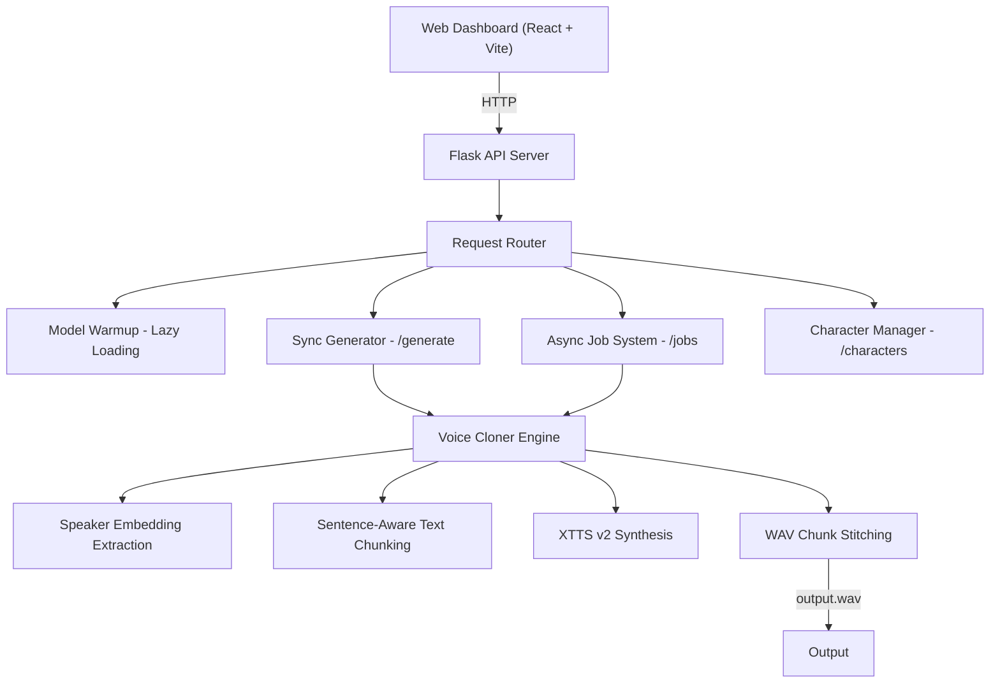

<div align="center">


<br/>

<a href="https://www.python.org/"></a>
<a href="https://flask.palletsprojects.com/"></a>
<a href="https://pytorch.org/"></a>
<a href="https://github.com/idiap/coqui-ai-TTS"></a>
<a href="https://reactjs.org/"></a>
<a href="https://vitejs.dev/"></a>
<a href="https://www.docker.com/"></a>
<a href="./LICENSE"></a>

<br/><br/>

> **Paste a 10-second voice sample, type your script — get studio-quality cloned anime dialogue. No API keys. No cloud. Runs entirely on your machine.**

<br/>

</div>

---

## What is Voice Cloner Agent?

**Voice Cloner Agent** is a self-hosted voice cloning engine that generates anime character dialogue from a short reference audio sample. It uses Coqui XTTS v2 for zero-shot cloning — no model training, no fine-tuning.

Built for short-form video creators targeting YouTube Shorts, Instagram Reels, and TikTok.

```
Voice Sample  -->  Speaker Embedding  -->  Text Chunking  -->  XTTS v2 Synthesis
                                                                       |
                            Output WAV  <--  Stitch & Merge  <--  Chunk WAVs
```

---

## Features

| Feature | Details |
|---|---|
| **Zero-Shot Voice Cloning** | Clone any voice from a 10-60 second audio sample. No fine-tuning or training step required. |
| **Async Job System** | Submit long scripts via the `/jobs` endpoint with real-time progress polling and ETA estimates. |
| **Chunked Synthesis** | Long text is split into sentence-aware chunks, synthesized individually, then stitched into a single WAV. |
| **Model Warmup Control** | Explicit `/model/warmup` endpoint to pre-load the TTS model before the first generation request. |
| **Custom Character Upload** | Upload new voice samples through the API or dashboard UI for instant character addition. |
| **Consent Workflow** | Built-in legal consent checklist in the dashboard before any voice generation or upload. |
| **Real-Time Dashboard** | React-based control panel with live progress tracking, health monitoring, and model status display. |
| **CPU and GPU Support** | Runs on CPU out of the box. Optional CUDA acceleration for significantly faster inference. |

---

## Web Dashboard

The built-in dashboard runs at `http://localhost:5173` and lets you:

- Select a character or upload a custom voice sample
- Enter text and generate cloned speech with one click
- Watch real-time synthesis progress with chunk-level updates
- Monitor backend health, model warmup state, and character readiness
- Accept legal consent before generating or uploading

---

## Quick Start

### Prerequisites

- **Python 3.11+**
- **Node.js 18+**
- **NVIDIA GPU** (optional) with CUDA 11.8+ for hardware acceleration

### Option 1 -- Manual Setup

```bash
git clone https://github.com/yourusername/voice-cloner-agent.git
cd voice-cloner-agent

# Backend
python -m venv .venv
.venv\Scripts\activate          # Windows
source .venv/bin/activate       # Linux / macOS
pip install -r requirements.txt

# Frontend
cd dashboard
npm install
```

### Option 2 -- Docker

```bash
docker-compose up --build
```

### Start the Application

**Terminal 1 -- Backend:**

```bash
python backend/tts_server.py
```

**Terminal 2 -- Dashboard:**

```bash
cd dashboard
npm run dev
```

The API server runs at `http://localhost:5000` and the dashboard at `http://localhost:5173`.

### Prepare a Voice Sample

Place a 10-60 second WAV file in the `voice_samples/` directory:

```
voice_samples/madara_uchiha_sample.wav
```

To convert from MP3:

```bash
python scripts/setup_audio.py
```

See [docs/AUDIO_SETUP.md](docs/AUDIO_SETUP.md) for detailed voice sample preparation guidelines.

---

## CLI Usage

Run the test script directly without the web dashboard:

```bash
python test_madara.py
```

Output is saved to `output/madara_test_output.wav`.

### Generate via cURL

```bash
# Synchronous generation
curl -X POST http://localhost:5000/generate \
  -H "Content-Type: application/json" \
  -d '{"text": "Power is not determined by abstract concepts.", "character": "madara"}' \
  --output output.wav

# Async job
curl -X POST http://localhost:5000/jobs \
  -H "Content-Type: application/json" \
  -d '{"text": "Your long script here...", "character": "madara"}'

# Poll progress
curl http://localhost:5000/jobs/<job_id>

# Download audio
curl http://localhost:5000/jobs/<job_id>/audio --output output.wav
```

---

## Architecture



---

## How the Pipeline Works

### Step 1 -- Load Model
The XTTS v2 model (~2 GB) is loaded lazily on first request and cached in memory. Use `/model/warmup` to pre-load before the first generation call.

### Step 2 -- Speaker Embedding
The reference audio sample is processed to extract a speaker embedding vector that captures the voice characteristics. Requires a clean 10-60 second WAV file.

### Step 3 -- Text Chunking
Long text is split into sentence-aware chunks to avoid synthesis quality degradation on long inputs. Each chunk is processed independently.

### Step 4 -- Synthesis
XTTS v2 performs autoregressive speech synthesis on each chunk using the extracted speaker embedding. Progress is reported per chunk for async jobs.

### Step 5 -- Stitch and Output
All synthesized chunks are concatenated into a single WAV file. For async jobs, status transitions to `completed` and the audio becomes available via `/jobs/:id/audio`.

---

## API Reference

Full endpoint documentation is available at [docs/API_REFERENCE.md](docs/API_REFERENCE.md).

### Endpoints

| Method | Endpoint | Description |
|---|---|---|
| GET | `/health` | Server health check |
| GET | `/characters` | List available characters with voice sample status |
| POST | `/characters` | Upload a new character voice sample |
| GET | `/setup-status` | Voice sample configuration status |
| GET | `/model-status` | TTS model loading state and progress |
| POST | `/model/warmup` | Trigger model pre-loading |
| POST | `/generate` | Synchronous speech generation (blocks until complete) |
| POST | `/jobs` | Asynchronous job creation with progress tracking |
| GET | `/jobs/:id` | Poll job progress and status |
| GET | `/jobs/:id/audio` | Stream or download completed audio |

### Constraints

| Parameter | Limit |
|---|---|
| Text length (synchronous) | 500 characters |
| Text length (asynchronous) | 2500 characters |
| Upload file size | 50 MB |
| Accepted audio formats | `.wav`, `.mp3`, `.m4a`, `.flac`, `.ogg` |

---

## Project Structure

```
voice-cloner-agent/
├── backend/
│   ├── voice_cloner.py            # Core TTS pipeline: chunking, synthesis, WAV stitching
│   ├── tts_server.py              # Flask API: endpoints, job management, model lifecycle
│   ├── requirements.txt           # Python dependency manifest
│   ├── requirements_modern.txt    # Pinned versions for Python 3.11+
│   ├── requirements_legacy.txt    # Fallback versions for older environments
│   └── models/                    # Auto-downloaded TTS model weights (not tracked)
│
├── dashboard/
│   ├── src/
│   │   ├── App.tsx                # Root component: layout, state, generation flow
│   │   ├── api.ts                 # Typed HTTP client for all backend endpoints
│   │   ├── main.tsx               # React entry point
│   │   ├── styles.css             # Global styles
│   │   └── components/
│   │       ├── BackendStatusPanel.tsx    # Server health and model warmup controls
│   │       ├── ConsentChecklist.tsx      # Legal consent gate
│   │       ├── ProgressPanel.tsx         # Real-time job progress with metrics
│   │       └── UploadPanel.tsx           # Custom character voice upload form
│   ├── index.html
│   ├── package.json
│   ├── vite.config.ts
│   ├── tsconfig.json
│   ├── tailwind.config.js
│   └── postcss.config.cjs
│
├── scripts/
│   ├── setup_audio.py             # MP3 to WAV conversion utility
│   └── convert_audio.py           # Batch audio format converter
│
├── tests/                         # pytest test suite
├── docs/                          # Setup guides and API reference
├── voice_samples/                 # Reference audio files (not tracked)
├── output/                        # Generated audio output (not tracked)
│
├── .github/workflows/ci.yml
├── .env.example
├── .gitignore
├── Dockerfile
├── docker-compose.yml
├── Makefile
├── requirements.txt               # Root-level dependency entrypoint
├── test_madara.py                 # CLI test script
├── CONTRIBUTING.md
├── LICENSE
└── README.md
```

---

## Dependencies

### Core Libraries

| Library | Purpose | Badge |
|---|---|---|
| [Coqui TTS](https://github.com/idiap/coqui-ai-TTS) | XTTS v2 zero-shot voice cloning engine |  |
| [PyTorch](https://pytorch.org/) | Deep learning inference runtime |  |
| [torchaudio](https://pytorch.org/audio/) | Audio processing and I/O |  |
| [Transformers](https://huggingface.co/docs/transformers/) | Hugging Face model utilities |  |
| [Flask](https://flask.palletsprojects.com/) | Backend REST API server |  |
| [NumPy](https://numpy.org/) | Numerical computation |  |

### Frontend

| Library | Purpose | Badge |
|---|---|---|
| [React](https://reactjs.org/) | UI component framework |  |
| [TypeScript](https://www.typescriptlang.org/) | Static type checking |  |
| [Vite](https://vitejs.dev/) | Development server and bundler |  |
| [Tailwind CSS](https://tailwindcss.com/) | Utility-first CSS framework |  |
| [Lucide React](https://lucide.dev/) | Icon library |  |

### System Requirements

| Tool | Requirement |
|---|---|
| **Python** | 3.11 or higher |
| **Node.js** | 18.0 or higher |
| **RAM** | 4 GB minimum, 8 GB+ recommended |
| **Disk Space** | 3 GB minimum (5 GB with model weights) |
| **GPU** (optional) | NVIDIA with CUDA 11.8+ for accelerated inference |

---

## Configuration

Copy `.env.example` to `.env` and edit:

```env
VOICE_CLONER_GPU=0              # Set to 1 for CUDA acceleration
VOICE_CLONER_PRELOAD=1          # Set to 0 to skip model pre-loading on start
VOICE_CLONER_DEBUG=0            # Set to 1 for Flask debug mode
VITE_API_BASE_URL=http://localhost:5000
```

---

## Running Tests

```bash
pip install pytest
pytest tests/ -v
```

---

## Troubleshooting

| Problem | Cause | Solution |
|---|---|---|
| First run takes 5-10 minutes | XTTS v2 model downloading (~2 GB) | Wait for download to complete. Subsequent runs use cached model. |
| `CUDA not found` error | GPU mode enabled without CUDA toolkit | Set `VOICE_CLONER_GPU=0` or install the CUDA toolkit. |
| `Voice sample not found` | Missing reference WAV file | Place audio at `voice_samples/madara_uchiha_sample.wav`. |
| Audio quality is poor | Reference sample too short or noisy | Use a clean 30-60 second sample with minimal background noise. |
| `ModuleNotFoundError: TTS` | Dependencies not installed | Run `pip install -r requirements.txt` in your virtual environment. |
| Dashboard shows "API Offline" | Backend server not running | Start the backend with `python backend/tts_server.py`. |

---

## Roadmap

- [x] Single character voice cloning (Madara Uchiha)
- [x] Synchronous and asynchronous generation endpoints
- [x] Sentence-aware text chunking and WAV stitching
- [x] Real-time job progress tracking with ETA
- [x] React dashboard with model warmup controls
- [x] Custom character upload via API and UI
- [x] Legal consent workflow
- [ ] Additional character presets (Luffy, Rem, Todoroki, Zenitsu)
- [ ] Audio waveform visualization during playback
- [ ] Emotion and expression control tags
- [ ] WebSocket-based real-time progress (replace HTTP polling)
- [ ] Audio caching with content-hash deduplication
- [ ] Multi-language support (XTTS v2 supports 13+ languages)
- [ ] Model quantization (INT8) for reduced memory footprint

---

## Contributing

Contributions are welcome. See [CONTRIBUTING.md](CONTRIBUTING.md) for guidelines.

---

## License

This project is licensed under the **MIT License** -- see the [LICENSE](LICENSE) file for details.

---

<div align="center">

Built with Python, PyTorch, and XTTS v2.


</div>
